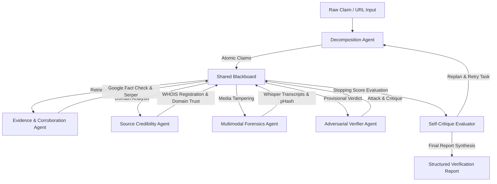

# Scrutin

[](https://www.python.org/)
[](https://opensource.org/licenses/MIT)
[](https://ai.pydantic.dev/)

**Scrutin** is a production-grade, terminal-first multi-agent misinformation verification and fact-checking engine. Built to combat fake news, media manipulation, and domain-level spoofing, it coordinates six independent cognitive agents through a hub-and-spoke Blackboard architecture. 

Unlike traditional graphs that rely on rigid DSL control flows, Scrutin operates on a plain Python orchestration loop with Reflexion-based self-critique and adversarial red-teaming.

---

## System Architecture

Scrutin implements a decoupled hub-and-spoke state orchestration using a shared Blackboard. Sub-agents do not import or call each other; they communicate exclusively by placing typed `AgentRequest` messages on the Blackboard.



---

## Key Features

*   **Atomic Claim Decomposition:** Parses complex articles, media transcripts, and screenshots into list-form checkable claims, separating factual assertions from rhetoric.
*   **Dual-Path Retrieval:** Google Fact Check API database fast-path lookup, falling back to multi-key Serper.dev Google search queries with a Jina Reader Markdown scraper.
*   **Source Credibility (EDC Memory):** Evaluates publisher registry age via WHOIS and tracks domain track records using an Extract-Deduplicate-Commit (EDC) SQLite pipeline.
*   **Adversarial Verification:** A dedicated "Red Team" agent operating on an independent model provider (Groq Llama) tries to poke holes in the provisional verdict, preventing model alignment bias.
*   **Reflexion Self-Critique:** A deterministic-picker evaluator grades evidence quality against a stopping score. If criteria are unmet, the agent reflects, logs the lesson in episodic memory, and replans.
*   **WAL-Mode SQLite Persistence:** Concurrency-safe local episodic memory ensuring multiple async requests run without database locking.

---

## Tech Stack & Model Alignment

| Component | Technology | Model / Provider |
|---|---|---|
| **Orchestrator** | Python `while` loop | Gemini 2.5 Flash |
| **Agents Framework** | PydanticAI | Pydantic v2 validation |
| **Paid Search API** | Serper.dev | Key pool round-robin |
| **Free Search Fallback** | DuckDuckGo Keyless scraper | Stateless |
| **Decomposition Agent** | Groq Llama 3.1 8B | Instant parser |
| **Evidence & Forensics** | Google Cloud APIs | Gemini 2.5 Flash |
| **Adversarial & Credibility** | Groq Llama 3.3 70B | Llama-3.3-70b-versatile |
| **Episodic Memory** | SQLite WAL mode | `aiosqlite` |
| **Semantic Memory** | Pinecone | `gemini-embedding-001` (786-dim) |

---

## Installation & Setup

### Prerequisites
*   Python 3.11 or 3.12
*   Optional: `ffmpeg` (for media file transcriptions)

### 1. Clone & Setup Virtual Environment
```bash
git clone https://github.com/yourusername/scrutin.git
cd scrutin
python -m venv .venv
# On Windows:
.venv\Scripts\activate
# On macOS/Linux:
source .venv/bin/activate
```

### 2. Install Dependencies
```bash
pip install -r requirements.txt
```

### 3. Environment Configuration
Copy the environment template and populate it with your provider credentials:
```bash
cp .env.example .env
```
*At a minimum, configure `GOOGLE_API_KEY`, `GROQ_API_KEY`, and `SERPER_API_KEY` in `.env`.*

### 4. Run SQLite Migrations
Initialize the local memory schema (creates 4 index-optimized tables in `scrutin.db`):
```bash
python -m app.memory.migrations
```

---

## CLI Usage Guide

Scrutin is fully interactive and configurable directly via the command line:

```bash
# Verify a claim with full agent trace logger outputs
python -m app.cli verify --claim "The Eiffel Tower was built in 1889" --trace

# Verify an article by scraping its URL
python -m app.cli verify --url "https://example.com/breaking-news-article"

# Run the ground-truth verification regression suite (5 test claims)
python -m app.cli test

# Query SQLite episodic logs and print calibration metrics (ECE score)
python -m app.cli stats
```

---

## Expected Terminal Output

```
12:04:33 | INFO     | orchestrator       | Run started: a1b2c3 | input_type=text
12:04:33 | INFO     | decomposition      | Decomposed → 1 claim: C1 (event_occurrence)
12:04:34 | INFO     | orchestrator       | Iteration 1: Launching evidence on C1
12:04:34 | INFO     | evidence_agent     | Fast-path: Google Fact Check → 0 matches
12:04:35 | INFO     | evidence_agent     | Searching: 'Eiffel Tower construction year' → 8 results via serper
12:04:35 | INFO     | evidence_agent     | Stored WB1 (en.wikipedia.org)
12:04:36 | INFO     | evidence_agent     | Finding: stance=supports, confidence=0.94
12:04:36 | INFO     | orchestrator       | Iteration 2: Launching credibility on domain wikipedia.org
12:04:37 | INFO     | credibility_agent  | Finding: stance=mixed, confidence=0.90
12:04:37 | INFO     | orchestrator       | Iteration 3: Launching adversarial_agent
12:04:39 | INFO     | adversarial        | verdict_stands=True ✓
12:04:39 | INFO     | orchestrator       | Stopping criteria met ✓

╭──────────────── Scrutin Verification Report ─────────────────╮
│  Run ID     a1b2c3                                            │
│  Verdict    TRUE                                              │
│  Score      85 / 100                                          │
│  Confidence 92%                                               │
│  Iterations 3 / 20                                            │
│  Time       5.4s                                              │
│  Sources    en.wikipedia.org, britannica.com                  │
╰───────────────────────────────────────────────────────────────╯
```

---

## License

This project is licensed under the MIT License. See [LICENSE](LICENSE) for details.
