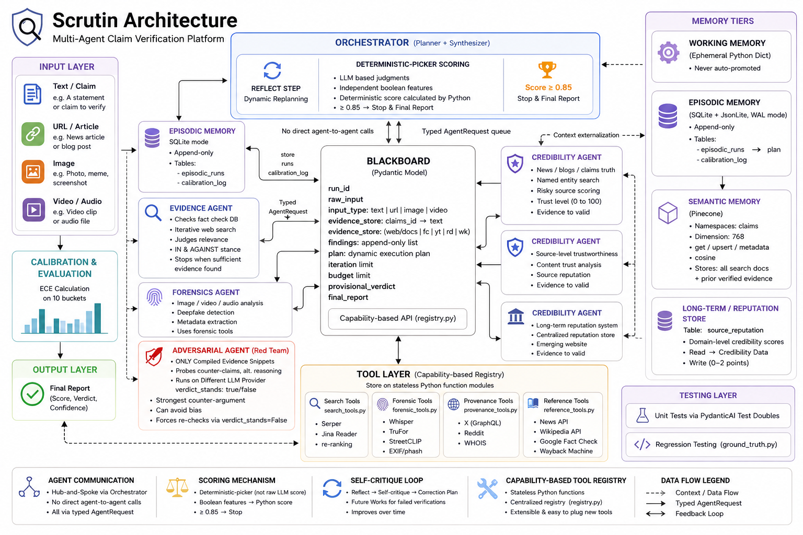

# Scrutin 🔍

> **Multi-agent AI misinformation verification platform.**
> Submit a claim or article URL — six independent AI agents investigate, cross-reference, and deliver a structured, calibrated verdict you can trust.

[](https://www.python.org/)
[](https://fastapi.tiangolo.com/)
[](https://react.dev/)
[](https://ai.pydantic.dev/)
[](LICENSE)

---

## 📖 Overview

Scrutin is built from first principles around one idea: **verifying a claim is an unpredictable reasoning task, not a lookup.** A single-sentence claim from a reliable outlet might resolve with one fact-check API hit. A manipulated video with a misleading caption might need forensic analysis, transcript extraction, reverse image search, and several rounds of adversarial re-checking before a verdict is safe to publish.

A simple RAG (Retrieval-Augmented Generation) pipeline can't flex like that — it does the same fixed number of retrieval steps regardless of how hard the claim actually is. Scrutin instead uses a **hub-and-spoke multi-agent architecture**: six specialized cognitive agents, each with a narrow job and explicit prohibitions, coordinated by an Orchestrator through a shared **Blackboard** — a run-scoped, append-only state object every agent reads from and writes to.

The system is designed to be:
- **Adaptive** — the Orchestrator dynamically replans based on what's still missing, rather than running a fixed pipeline.
- **Self-skeptical** — a dedicated Adversarial Verifier, running on a *different* model provider, actively tries to break every provisional verdict before it ships.
- **Calibrated, not vibes-based** — confidence scores are composed by Python from independent boolean judgments (the "deterministic-picker" pattern), never taken as a raw LLM float.
- **Auditable** — every agent's reasoning, every piece of evidence, and every adversarial critique is retained in the final report and the episodic log.

---

## 🤖 The Six Cognitive Agents

| # | Agent | Model | Goal | Explicitly Forbidden From |
|---|-------|-------|------|---------------------------|
| 1 | **Orchestrator** 🧠 (Planner + Synthesizer) | `gemini-2.5-flash` | Hold global state, plan execution, delegate, resolve conflicts, write the final verdict | Fabricating evidence · skipping the Adversarial step · calling sub-agents directly (must go through the Plan) |
| 2 | **Claim Decomposition & Framing** 🧩 | `groq:llama-3.1-8b-instant` | Convert raw input into atomic, checkable claims; separate fact from opinion/framing | Judging truth/falsity · using tools · inventing claims not in the source text |
| 3 | **Evidence & Corroboration** 🕵️‍♂️ | `gemini-2.5-flash` | Run iterative search, judge relevance, flag evidence gaps | Setting the final credibility score · judging source trustworthiness · forensic media analysis |
| 4 | **Source & Provenance Credibility** 🏛️ | `groq:llama-3.3-70b-versatile` | Judge the *originating source's* trustworthiness (track record, ownership, domain age) | Judging whether the claim's *content* is true · running new web searches · writing reputation updates directly |
| 5 | **Multimodal Forensics** 🔬 | `gemini-2.5-flash` | Judge media authenticity — manipulated, authentic-but-miscaptioned, or authentic-but-misleading | Judging whether the *caption* is true · forcing a binary real/fake call on mixed signals |
| 6 | **Adversarial Verifier ("Red Team")** 🛡️ | `groq:llama-3.3-70b-versatile` | Attack the provisional verdict with the strongest good-faith counter-argument | Running general new searches · inheriting the Evidence agent's reasoning trace · setting the final verdict itself |

Full system prompts for each agent — including their exact output schemas — live in [`agent-system-prompts.md`](./agent-system-prompts.md).

**Why the Adversarial Verifier runs on a different provider:** it receives *only* the raw compiled evidence and the provisional verdict string — never the Evidence agent's reasoning trace or planning notes. Running it on Groq/Llama instead of Gemini avoids shared training biases between the "prosecution" and the "defense." This isolation is a hard, non-negotiable constraint (see [`AGENTS.md`](./AGENTS.md) §6).

---

## 🛠️ Architecture



Agents never call each other directly (hub-and-spoke only). All cross-agent requests are typed `AgentRequest` objects placed on the Blackboard; the Orchestrator's next loop iteration processes them.

```text
┌─────────────────────────────┐     HTTP POST /api/verify     ┌───────────────────────────────┐
│   React 19 + Vite Frontend  │ ───────────────────────────▶ │    Python FastAPI Backend      │
│   (port 5173 in dev)        │                               │    (port 8000)                 │
│                              │ ◀─── VerificationReport ───── │                                │
│  · Hero input                │                               │   ┌─────────────────────────┐  │
│  · SpatialScroll panels      │                               │   │      Orchestrator       │  │
│  · Verification workspace    │                               │   │   (Plan + Blackboard)   │  │
└─────────────────────────────┘                               │   └───────────┬─────────────┘  │
                                                                │               │ Tasks           │
                                                                │   ┌───────────┴─────────────┐  │
                                                                │   │  Decomposition  Evidence │  │
                                                                │   │  Credibility    Forensics│  │
                                                                │   │       Adversarial        │  │
                                                                │   └──────────────────────────┘  │
                                                                │        ▲ appends Findings        │
                                                                │        │ (never overwrites)       │
                                                                │   ┌────┴─────────────────────┐   │
                                                                │   │  Blackboard (Pydantic)   │   │
                                                                │   │  evidence_store / findings│  │
                                                                │   └──────────────────────────┘   │
                                                                └────────────────────────────────┘
```

**Core design rules** (enforced project-wide — see [`AGENTS.md`](./AGENTS.md) for the full list):
- No LangGraph or graph-DSL runtime — the orchestration loop is a plain `while` loop in `orchestrator/loop.py`.
- Every agent output is a validated Pydantic `BaseModel`. No raw dicts cross agent boundaries.
- Self-critique (Reflexion-style) is required before any final output — the LLM commits to booleans, Python composes the pass/fail signal.
- Heavy content (scraped HTML, transcripts) lives on the Blackboard by ID (`WB1`, `TR3`, ...); agents pass IDs, never raw content, in their messages.
- `asyncio.gather()` for any independent parallel tool/agent calls — never sequential `await` when there's no data dependency.

For the deep technical breakdown — Blackboard schema, the deterministic-picker scoring formula, the Reflexion self-critique loop, database tables, and the tool registry — see **[`ARCHITECTURE.md`](./ARCHITECTURE.md)**.
For getting the project running locally, see **[`SETUP.md`](./SETUP.md)**.

---

## 📡 API Reference

### `POST /api/verify`

Run a full multi-agent verification on a claim or URL.

**Request body:**
```json
{
  "claim": "The Eiffel Tower was built in 1889"
}
```

**Response:** `VerificationReport`
```json
{
  "run_id": "a1b2c3",
  "overall_verdict": "true",
  "credibility_score": 85.0,
  "confidence": 0.92,
  "iterations_used": 3,
  "processing_time_seconds": 5.4,
  "evidence_used": [...],
  "adversarial_summary": "...",
  "budget_exhausted": false
}
```

`overall_verdict` is one of `true | false | misleading | unverifiable | inconclusive`. `credibility_score` runs 0 (false) to 100 (true); `confidence` is the Orchestrator's calibrated 0.0–1.0 confidence in that score, derived from the deterministic-picker evaluation, not a raw model guess.

Interactive docs: `http://localhost:8000/api/docs` · Health check: `http://localhost:8000/api/healthz`.

---

## 🧪 Terminal-First Usage

The whole system can also be driven with no frontend at all:

```bash
python -m app.cli verify --claim "The COVID-19 vaccines caused 50,000 deaths in the US"
python -m app.cli verify --url "https://example.com/article"
python -m app.cli verify --claim "..." --trace   # verbose Blackboard trace
python -m app.cli test                            # ground-truth regression suite
python -m app.cli stats                           # calibration report (ECE)
```

Every step streams a structured, color-coded trace line via `loguru` — full example output is in [`ARCHITECTURE.md`](./ARCHITECTURE.md#terminal-trace-example).

---

## 🗺️ Roadmap & Future Reference

This section captures where the project is headed so design decisions made now stay consistent with where we're going.

### Coming soon: Scrutin SDK & API access
We're packaging the verification engine into developer-friendly SDKs so teams can integrate Scrutin without standing up the agent orchestration themselves:
- **Drop-in SDKs** for Python and Node/TypeScript.
- **Managed API keys** to route claims to hosted infrastructure.
- **Programmatic access** to `credibility_score`, `confidence`, and the raw adversarial critique object, for teams building their own trust & safety pipelines on top.

### Near-term technical roadmap
- **Calibration feedback loop**: `calibration_log` currently tracks stated confidence vs. actual outcome per run; the next step is closing the loop so Expected Calibration Error (ECE) informs prompt/threshold tuning automatically rather than via manual review (`python -m app.cli stats`).
- **Source reputation promotion**: `source_reputation` is SQLite-only for the MVP. Once WHOIS + track-record data volume grows, promote it to a proper write-through cache in front of live lookups.
- **Media hashing in Pinecone**: perceptual hashes (`imagehash.phash`) are stored as raw hex in SQLite for now because the free Pinecone tier only allows one index (already used for `claims` at `dimension=768`). Once a second index/tier is available, promote the `media` namespace to `dimension=64, metric="hamming"` — see [`database-schema.md`](./database-schema.md) for the exact migration note.
- **Reflexion memory reuse**: `AgentReflection` entries are written on `insufficient_evidence` or retried runs but not yet consulted at plan time. Wiring the Orchestrator to check episodic reflections for structurally similar past claims before planning is the next Reflexion-pattern upgrade.
- **Tool surface expansion**: `provenance_tools.py` currently covers WHOIS + X (via `bird_x.py`, cookie-based) + Reddit. Deliberately excluded for now: Instagram/LinkedIn/TikTok scrapers (too flaky for reliable verdicts — see [`tool-integration-spec.md`](./tool-integration-spec.md) for the full exclusion list and reasoning) and paid X/Grok API tiers.

### Explicitly out of scope (for now)
- Local Wikipedia FAISS index (`wiki_dump.py`) — the hosted Wikipedia API is lightweight enough for MVP needs.
- Any graph-DSL orchestration runtime (LangGraph, etc.) — studied for design patterns only, never imported. See [`AGENTS.md`](./AGENTS.md) §1.
- Duplicate/legacy Reddit client (`reddit.py`) — superseded by the PRAW-based implementation.

If you're picking this project back up after a break: read `AGENTS.md` first (the non-negotiable workspace rules), then `ARCHITECTURE.md` (how the pieces fit), then `SETUP.md` (get it running).

---

## 📜 License

MIT — see [LICENSE](LICENSE)
